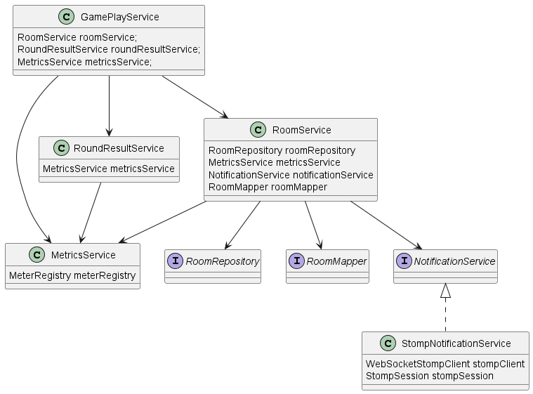
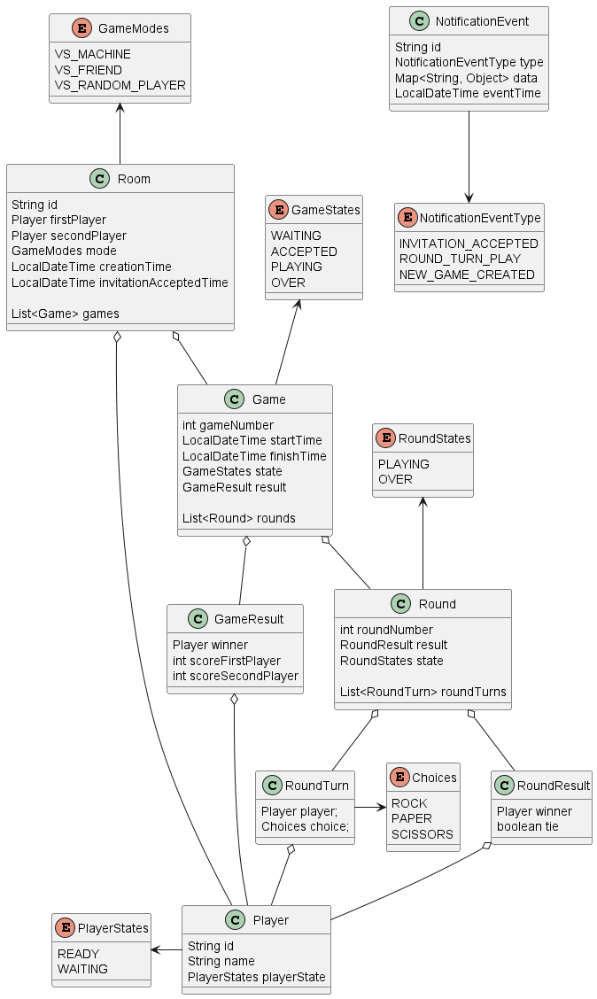

# RGPGame - backend
### Coding Challenge: Miguel Moncho

## Functional Added Features
- 3 game modes:
  - VS_MACHINE: Opponent moves are generated randomly by machine 
  - VS_FRIEND: Posible to play with a friend in a created game room
  - VS_RANDOM_PLAYER: Posibility to play with another random player
- Possibility to play many games with same player in created game room
- Each game ends when one player wins 3 rounds (configurable)
- Custom Metrics in Prometheus:
  - `rpsgame-rooms-created-count`: Number of game rooms created
  - `rpsgame-invites-accepted-count`: Number of rooms play invitations accepted (VS_FRIEND mode)
  - `rpsgame-invites-accepted-time`: Time between player 1 created room and player 2 accepted invitation (VS_FRIEND mode)
  - `rpsgame-games-created-count`: Number of games created
  - `rpsgame-games-over-count`: Number of games finished
  - `rpsgame-games-over-time`: Game duration time
  - `rpsgame-rounds-played-count`: Number of rounds played
  - `rpsgame-rounds-over-count`: Number of rounds finished
  - `rpsgame-turns-played-count`: Number of turns played
- Multi-language

## Technical Added Features
- OpenAPI documentation
- REST API secured using Basic Auth
- Websockets capability (update player game 2 events)
- Application Metrics to Prometheus
- Information persisted using MongoDB database
- Integration Tests & Unit Tests
- Dto mapping using MapStruct
- JaCoCo reports
- Included 2 PlantUML diagrams:
  - `plant-uml/rpsgame-model.puml` (Model Class diagram)
  - `plant-uml/rpsgame-services.puml` (Services Class diagram)

## Maven - Run

```sh
clean install jacoco:report spring-boot:run -Dspring-boot.run.arguments=--spring.profiles.active=dev
```
### Environment Variables required:
REST API is protected with Basic Auth, following ENV variables need to be provided in order to create a default user with Spring Security.

| Name | Value |
| ------ | ------ |
| API_REST_USERNAME | rpsplayer |
| API_REST_PASSWORD | ****** |

## Class diagram (Services):
- Main classes in services layer:
  - `RoomService`: Manage rooms (creation, invitations, ...)
  - `GamePlayService`: Manage a RPS game (game, rounds, turns, etc.)
  - `RoundResultService`: Calculate winner in a round
  - `MetricsService`: Manage custom metrics to Prometheus
  - `NotificationService`: Send game events over websockets (Stomp)



## Class diagram (Model):

